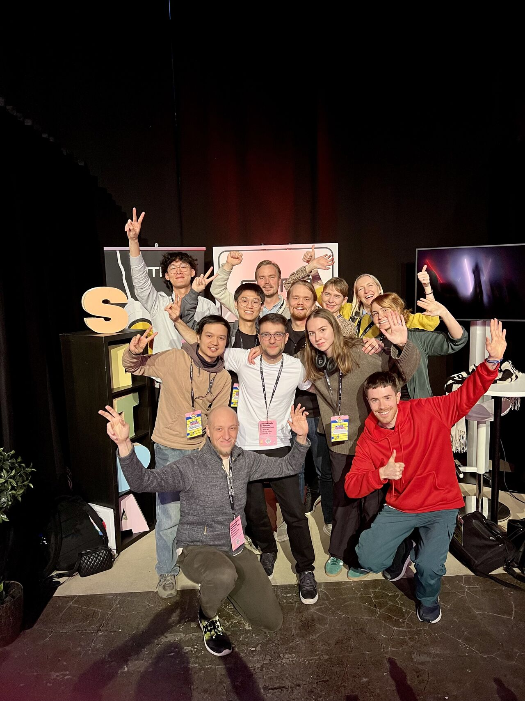

# Junction 2024: EyeDentity

We aim to help [Sitra](https://www.sitra.fi/) make Finland the world leader of digital democracy and ensuring human participation on the [Polis platform](https://pol.is) while maintaining anonymity. To address the issues, we created a human identifying tool based on deep gazing detection. It can be easily integrated with online vote platforms and provides a light-weight verification and progress tracking solution.

[Video Demo: EyeDentity](https://youtu.be/OQfNrrYMaao)

**Update:** [Won 2nd Place in the Sitra Partner Challenge](https://www.linkedin.com/feed/update/urn:li:activity:7261658280400224256/)


*Figure 1. 1st and 2nd Winners with Sitra experts*

## run on local

```shell
git clone git@github.com:James-Leste/eyedentity.git
cd eyedentity
npm i
npm run dev
```

The server should start on [http://localhost:5173/](http://localhost:5173/)

## Try online demo

[demo link](https://eyedentity-hazel.vercel.app)

**Note:** If the demo doesn't work for you or the camera is not being display, try:

-   refreashing the page
-   switching to one of the supported browsers
-   turning the camera permission off and on again
-   opening the link in incognito mode and provide the camera permission on the browser.

## Screenshots


*Figure 2. gaze tracking*

*Figure 3. [voting progress tracking simulator](https://github.com/Alimjan2013/is-ali/tree/main/app/polis) made by [Ali](https://github.com/Alimjan2013)*

## Supported Broswers


*Figure 4. supported browsers*

## Deep Model Used

[WebGazer.js from Brown University](https://webgazer.cs.brown.edu/#publication)

## Team members

-   James: [LinkedIn](https://www.linkedin.com/in/ziqi-wang-21baa8298/) [GitHub](https://github.com/James-Leste)
-   Ali: [LinkedIn](https://www.linkedin.com/in/alimjan-ablimit/) [GitHub](https://github.com/Alimjan2013)
-   Sean: [LinkedIn](https://www.linkedin.com/in/sihang-yu/) [GitHub](https://github.com/SihangYu7)

## Contribute

Create a [pull request](https://github.com/James-Leste/eyedentity/pulls) or [issue](https://github.com/James-Leste/eyedentity/issues)! We would love to hear from you! We will review it as soon as we can!

## License

[GNU GENERAL PUBLIC LICENSE](https://github.com/James-Leste/eyedentity/blob/main/LICENSE.md)
