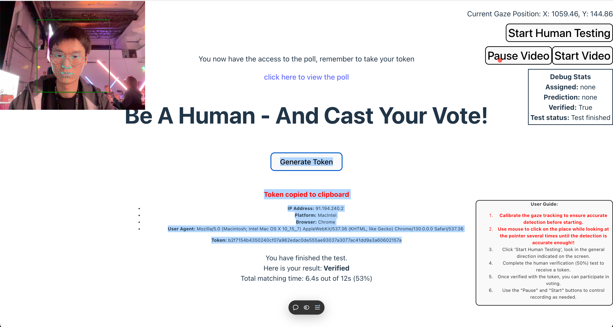

# Junction 2024: EyeDentity

We aim to make Finland the world leader of digital democracy and ensuring human participation on the Polis platform while maintaining anonymity. To address the issues, we created a human identifying tool based on deep gazing detection. It can be easily integrated with online vote platforms and provides light-weight verification and progress tracking solution.

[Video Demo: EyeDentity](https://youtu.be/OQfNrrYMaao)

## run on local

```shell
git clone git@github.com:James-Leste/eyedentity.git
cd eyedentity
npm i
npm run dev
```

## Try online demo

[demo](https://eyedentity-hazel.vercel.app)

**Note:** If the demo doesn't work for you or the camera is not being display, try:

-   refreash the page
-   turning the camera permission off and on again
-   open the link in incognito mode and provide the camera permission on the browser.

## Screenshots


_Figure 1. human identification_

_Figure 2. progress tracking simulator_

## Supported Broswers


